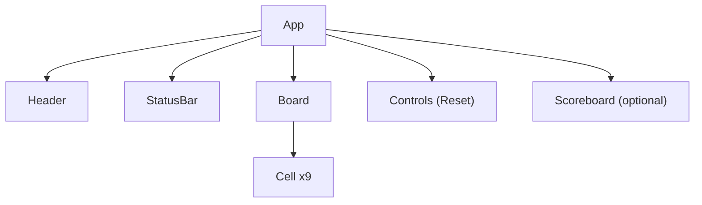

# Tic Tac Toe Web App - Architecture

## System Overview
The Tic Tac Toe frontend is a React-based single-page application that renders a responsive 3x3 grid board, manages turn-taking, detects wins and draws, and allows quick game resets. The architecture favors functional components and hooks, with a small, testable utility for the winner calculation. Styling adheres to the "Ocean Professional" theme with modern, minimalistic UI patterns.

## Tech Stack
- Framework: React (functional components with hooks)
- Language: JavaScript or TypeScript (project can start with JS and optionally evolve to TS)
- Styling: CSS Modules or Tailwind CSS (either approach acceptable; theme variables/colors applied consistently)
- Build Tooling: Standard React tooling (e.g., Vite or CRA; selection TBD)
- Testing: Jest + React Testing Library for unit/integration tests

## Project Structure
A suggested structure for clarity and modularity:
- src/
  - components/
    - App/
    - Header/
    - Board/
    - Cell/
    - StatusBar/
    - Controls/ (ResetButton)
    - Scoreboard/ (optional)
  - hooks/
    - useTicTacToeState.js
  - utils/
    - calculateWinner.js
  - styles/ (if using CSS Modules)
    - variables.css / theme.css
  - index.js
  - App.css (or Tailwind entry)

This structure keeps visual components separated from logic utilities and isolates hooks for state management.

## Component Architecture
- App
  - Top-level component that composes Header, StatusBar, Board, and Controls. Owns game state or composes a dedicated state hook.
- Header
  - Displays title and optional subtitle; aligns with the theme and site identity.
- StatusBar
  - Shows current player during gameplay and end-of-game status (win/draw). Announces changes via aria-live.
- Board
  - Renders a 3x3 grid of Cell components. Receives the board state and click handlers from App/state hook.
- Cell
  - Represents an individual square. Accessible button semantics, showing "X", "O", or empty.
- Controls (ResetButton)
  - Provides reset functionality. Optionally hosts additional controls.
- Scoreboard (optional)
  - Displays session-based tallies; can be implemented later.

### Component Relationships (Mermaid)


## State Management and Data Flow
- State Shape
  - board: array(9) of "X" | "O" | null
  - currentPlayer: "X" | "O"
  - winner: "X" | "O" | null
  - isDraw: boolean
- State Ownership
  - App holds state via React hooks or encapsulates logic in useTicTacToeState.
- Data Flow
  - Unidirectional: App/state hook passes props down to Board and StatusBar; Cells emit click events up through Board to App, where state is updated.
- Winner Calculation
  - A pure function utils/calculateWinner(board) returns "X", "O", or null. This function is unit tested.
- Persistence (Optional)
  - Local storage to persist board and currentPlayer on unload and restore on load. This is not required for MVP but is straightforward to add.

### Data Flow Diagram (Mermaid)
```mermaid
flowchart LR
  subgraph UI
    Cell["Cell (button)"] -->|onClick(index)| Board["Board"]
    Board -->|prop: onCellClick| App["App/useTicTacToeState"]
    App -->|props: board, currentPlayer| Board
    App -->|props: status| StatusBar["StatusBar"]
  end
  App -->|calls| Utils["calculateWinner(board)"]
  App -->|optional| Storage["localStorage"]
```

## Styling and Theming
- Theme: "Ocean Professional"
  - primary: #2563EB
  - secondary: #F59E0B
  - success: #F59E0B
  - error: #EF4444
  - background: #f9fafb
  - surface: #ffffff
  - text: #111827
- Guidelines:
  - Use background for page backdrop; surface for cards/board container.
  - Apply primary for focus rings, active states, and key accents.
  - Use secondary/success for highlights (e.g., winning state accent).
  - Error reserved for error messaging if needed.
  - Employ rounded corners, subtle shadows, and smooth transitions.
- Implementation:
  - Tailwind (preferred for speed) or CSS Modules with variables.css/theme.css.

## Error Handling and Edge Cases
- Ignore clicks on filled cells or when the game has ended.
- Ensure turns do not advance after a win/draw.
- Validate index ranges for cell clicks to prevent out-of-bounds updates.
- Provide a safe reset that reinitializes all state variables.
- Guard against malformed persisted state if local storage is enabled (fallback to default state).

## Testing Strategy (placeholder)
- Unit Tests
  - utils/calculateWinner: covers all winning lines and no-winner cases.
  - useTicTacToeState: turn alternation, move locking after win/draw, reset behavior.
- Component Tests
  - Board/Cell interactions: clicking cells updates board; keyboard navigation.
  - StatusBar: status messages and aria-live announcements.
- Accessibility Checks
  - Keyboard-only navigation and screen reader output.
- Performance
  - Basic render performance and bundle size sanity check.

## Accessibility and Performance
- Accessibility
  - Keyboard-accessible cells implemented as buttons with aria-labels.
  - StatusBar uses aria-live="polite" for turn and outcome updates.
  - Focus indicators with high contrast and visible outlines.
- Performance
  - Minimal state and pure logic for winner detection.
  - Small bundle footprint and fast initial render.

## Extensibility and Future Work
- Optional Features
  - Local storage persistence for last game state.
  - Winning line highlight and basic scoreboard.
  - Move history and time travel.
  - Single-player mode with simple AI.
- Architectural Considerations
  - Keep winner calculation pure and isolated for reuse and testing.
  - Maintain presentational vs. stateful component boundaries.
  - Encapsulate game state transitions within a custom hook to simplify future additions.
